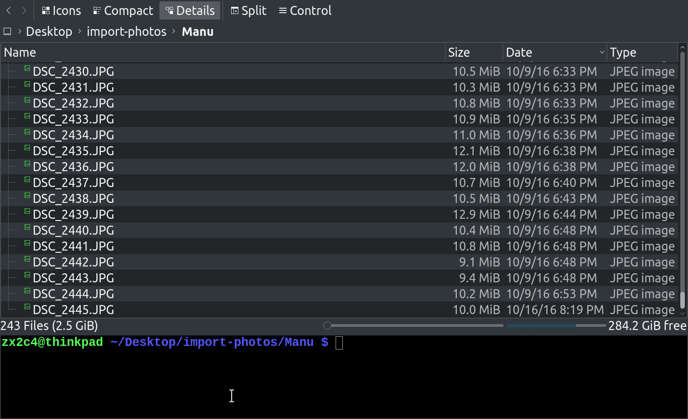

# Clockphoto
##### by [Jason A. Donenfeld](mailto:jason@zx2c4.com) of [zx2c4.com](https://www.zx2c4.com/)

Clockphoto adjusts a directory of photographs based on an image of a clock.

    $ clockphoto ./clock-photo.jpg /path/to/images

This will open a window asking you to enter the correct date and time of the clock photo. It then calculates the difference between what you entered and the EXIF timestamp of the photo, and adjusts all photos in the directory of photos by that difference.

If the image directory is unspecified, it is implicitly the enclosing directory of the clock photo.

### Building

This requires `exiv2` and `qt5`.

    $ qmake
    $ make
    $ ./clockphoto CLOCK_PHOTO [IMAGE_DIRECTORY]

### Demo

